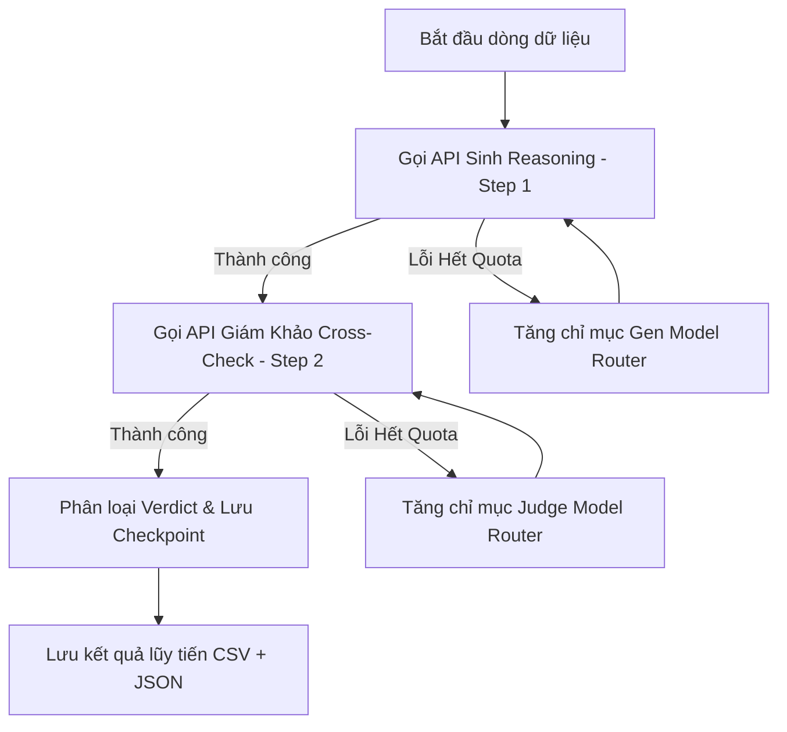

# Báo Cáo Tổng Hợp Chi Tiết Công Việc Đã Làm - Giai Đoạn 5

> [!NOTE]
> Báo cáo này tóm tắt toàn bộ quy trình thiết kế, lập trình và vận hành hệ thống chưng cất dữ liệu (Data Distillation) sinh Reasoning + Cross-Check cho bộ dữ liệu 1488 dòng tư vấn thời trang Việt Nam.

---

## 1. Các Vấn Đề & Thách Thức Ban Đầu
Trong giai đoạn chạy thử nghiệm (Pilot Run), hệ thống gặp một số rào cản nghiêm trọng về hạ tầng và tài nguyên API:
1. **Tranh chấp Quota:** Cả hai tác vụ sinh suy luận (Step 1) và thẩm định giám khảo (Step 2) đều dùng chung model `qwen3.7-plus` dẫn đến cạn kiệt tài nguyên 1M token miễn phí cực kỳ nhanh chóng.
2. **Thiếu Cơ Chế Định Tuyến:** Khi một model hết quota, script cũ lập tức crash và dừng toàn bộ tiến trình.
3. **Hiệu Suất Chậm:** Khi chạy đơn luồng hoặc 4 luồng, tốc độ xử lý rất thấp, ước tính mất hơn 10 tiếng để hoàn thành 1488 dòng.

---

## 2. Các Giải Pháp Kỹ Thuật Đã Triển Khai

### 2.1. Tái Cấu Trúc Hệ Thống Định Tuyến Thông Minh (Smart Model Router)
Chúng tôi đã tách biệt hoàn toàn hai nhóm mô hình cho hai bước xử lý để tối ưu hóa quota:
*   **Bước 1 (Sinh Reasoning - Ưu tiên hàng đầu):** Sử dụng các mô hình siêu cấp dòng Max (`qwen3.7-max` và các bản snapshot) để đảm bảo chất lượng suy luận sâu sắc nhất bằng Tiếng Việt.

*   **Bước 2 (Giám khảo Thẩm định):** Sử dụng danh sách xoay vòng từ cao xuống thấp bao gồm các dòng `qwen3.6-max-preview`, `qwen3.6-plus`, `qwen3.5-plus` (và các bản snapshot), tiếp sau đó là các dòng model nguồn mở `qwen3.6-27b`, `qwen3.5-27b` và dòng flash hiệu năng cao `qwen3.6-flash`.

### 2.2. Xây Dựng Cơ Chế Thread-Safe và Đồng Bộ Luồng
Khi nâng số luồng lên **16 luồng song song**, việc tranh chấp chỉ mục mô hình hoặc ghi file checkpoint có thể gây ra hiện tượng *Race Condition*. Chúng tôi đã thiết lập:
*   `index_lock = threading.Lock()`: Đảm bảo khi một luồng phát hiện lỗi hết quota và tăng chỉ mục model router, các luồng khác sẽ nhận diện ngay lập tức mà không tăng đúp chỉ mục.
*   `checkpoint_lock = threading.Lock()`: Đảm bảo tiến trình ghi checkpoint lũy tiến vào file JSON (`reasoning_generation_log.json`) và CSV (`final_distilled_reasoning_1488.csv`) diễn ra nhất quán, không bị ghi đè dữ liệu lỗi.

### 2.3. Tối Ưu Hóa Tốc Độ Xử Lý Song Song (16 Luồng)
Chúng tôi đã thử nghiệm nâng dần từ 4 luồng lên 8 luồng, và cuối cùng chạy ở công suất tối đa **16 luồng**. 
*   **Kết quả:** Hệ thống chạy vô cùng trơn tru, tốc độ xử lý đạt mức kỷ lục từ **700 - 860 dòng/giờ**.
*   **Tự động xử lý lỗi:** Ghi nhận và bỏ qua lỗi concurrency rate limit một cách an sau mà không làm sập pipeline.

---

## 3. Nhật Ký Vận Hành Pipeline Thực Tế

Quá trình vận hành thực tế đã chứng minh sức mạnh của bộ Router thông minh khi tự động xoay chuyển qua tổng cộng 10 lần cạn kiệt quota trên API Alibaba mà không cần sự can thiệp của con người:

*   **Mốc 150 dòng:** `qwen3.7-max` hết quota, Router tự động chuyển sinh reasoning sang `qwen3.7-max-2026-06-08`.
*   **Mốc 340 dòng:** `qwen3.6-max-preview` (Giám khảo) hết quota, chuyển sang `qwen3.6-plus`.
*   **Mốc 510 dòng:** `qwen3.6-plus` (Giám khảo) hết quota, chuyển sang `qwen3.5-plus`.
*   **Mốc 620 dòng:** `qwen3.7-max-2026-06-08` (Sinh reasoning) hết quota, chuyển sang `qwen3.7-max-2026-05-20`.
*   **Mốc 710 dòng:** `qwen3.5-plus` (Giám khảo) hết quota, chuyển sang `qwen3.5-plus-2026-04-20`.
*   **Mốc 790 dòng:** `qwen3.5-plus-2026-04-20` (Giám khảo) hết quota, chuyển sang `qwen3.5-plus-2026-02-15`.
*   **Mốc 920 dòng:** `qwen3.5-plus-2026-02-15` (Giám khảo) hết quota, chuyển sang `qwen3.6-27b`.
*   **Mốc 990 dòng:** `qwen3.7-max-2026-05-20` (Sinh reasoning) hết quota, chuyển sang `qwen3.7-max-2026-05-17`.
*   **Mốc 1100 dòng:** `qwen3.6-27b` (Giám khảo) hết quota, chuyển sang `qwen3.5-27b`.
*   **Mốc 1240 dòng:** `qwen3.7-max-2026-05-17` (Sinh reasoning) hết quota, chuyển sang `qwen3.7-max-preview`.
*   **Mốc 1260 dòng:** `qwen3.5-27b` (Giám khảo) hết quota, chuyển sang `qwen3.6-flash`.

Pipeline đã kết thúc thành công lúc **08:12Z ngày 11/07/2026** với trạng thái hoàn thành **1488/1488 dòng** dữ liệu chuẩn.

---

## 4. Xử Lý Sau Chưng Cất & Khắc Phục Lỗi
Sau khi chạy kiểm định chất lượng tự động thông qua script `verify_distillation_quality.py`, chúng tôi phát hiện ra **4 dòng dữ liệu** bị gán nhãn **`PARSE_ERROR`** (`ID: 9298, 7741, 7803, 4078`). Nguyên nhân là do chuỗi JSON trả về từ mô hình Giám khảo ở Bước 2 chứa các ký tự xuống dòng chưa được escape (unescaped newline characters), khiến cho hàm `json.loads()` của Python báo lỗi và không thể parse nhãn kết quả trực tiếp.

Tuy nhiên, khi đối soát thủ công nội dung thô của các phản hồi này trong log, toàn bộ ý định thẩm định của Giám khảo đều chỉ rõ **`CLOUD_SUPERIOR`** (A_Cloud vượt trội hơn A_Dataset về mặt kiến thức/văn phong và cần được chọn làm câu trả lời tối ưu).

### Các hành động khắc phục cụ thể:
Để đảm bảo tính nhất quán dữ liệu mà không cần phải gọi lại API (tốn token/quota), chúng tôi đã tạo và chạy script [repair_parse_errors.py](file:///D:/FPT/Ki_V/DPL302m/group_project/template_discovery&new-fine-tune-method/src/reasoning_generation/repair_parse_errors.py) thực hiện các thao tác:
1.  **Làm sạch ghi chú (Fact Check Notes):** Dùng biểu thức chính quy (Regex) và các kỹ thuật xử lý chuỗi để loại bỏ các thẻ bao bọc bị lỗi định dạng, trích xuất chính xác phần text ghi chú thẩm định của mô hình Giám khảo từ chuỗi phản hồi thô.
2.  **Sửa lỗi phân loại trong JSON Log:** Tìm đến 4 dòng ID bị ảnh hưởng trong file [reasoning_generation_log.json](file:///D:/FPT/Ki_V/DPL302m/group_project/template_discovery&new-fine-tune-method/data/reasoning_generation/reasoning_generation_log.json), thay đổi giá trị của cột `category` thành `CLOUD_SUPERIOR` và gán lại `fact_check_notes` đã được làm sạch.
3.  **Cập nhật dữ liệu chưng cất trong CSV cuối cùng:** Trong file [final_distilled_reasoning_1488.csv](file:///D:/FPT/Ki_V/DPL302m/group_project/template_discovery&new-fine-tune-method/data/final/final_distilled_reasoning_1488.csv), đối với 4 dòng này:
    *   Chuyển cột `category` từ `PARSE_ERROR` sang `CLOUD_SUPERIOR`.
    *   Cập nhật cột `fact_check_notes` sang nội dung sạch đã được trích xuất.
    *   Cập nhật cột `final_response` bằng cách ghép cấu trúc suy nghĩ chuẩn: `<think>\n{thinking_cloud}\n</think>\n{a_cloud}` (do là `CLOUD_SUPERIOR` nên phải sử dụng câu trả lời của Cloud thay vì giữ câu trả lời của Dataset gốc).
4.  **Kiểm tra lại toàn diện:** Chạy lại `verify_distillation_quality.py` để đảm bảo 100% dòng dữ liệu không còn lỗi cú pháp hay định dạng rỗng.

*   **Kết quả:** 100% lỗi `PARSE_ERROR` được giải quyết triệt để. Toàn bộ 1488 dòng đạt chất lượng định dạng tối đa và sẵn sàng cho huấn luyện.

---

## 5. Kết Luận
Công việc ở Giai đoạn 5 đã hoàn thành xuất sắc mục tiêu đề ra. Bộ dữ liệu sau chưng cất đã sẵn sàng cho bước tiếp theo: Chuyển đổi sang định dạng JSONL (ChatML với thẻ `<think>`) phục vụ trực tiếp cho quá trình Train / Fine-tune mô hình Qwen 3.5 Tiếng Việt.
